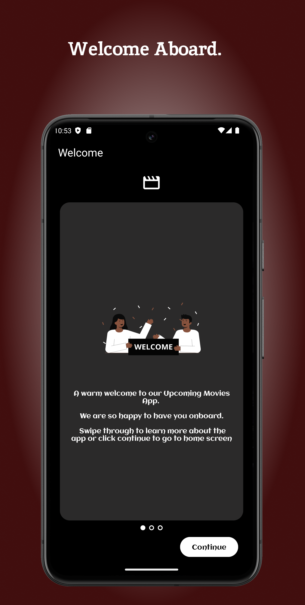
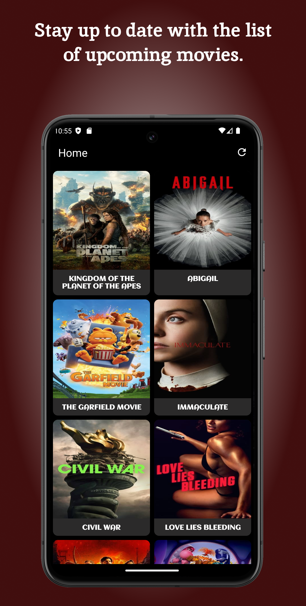

#  Upcoming-Movies
Project 5: Android Kotlin Developer Udacity | Nanodegree

## App ScreenShots
|   |   |   |  |
|:-------------------------------:|:-------------------------------:|:-------------------------------:|:------------------------------:|

[//]: # (|  |  |  |)
## Rationale
> The App is inspired by The Android Kotlin Developer Nanodegree Course on Udacity. It's the final project of the Five projects in the course.
> I Chose to develop a custom app, so I can build everything from scratch. It's been fun. 

## Project Instructions 
+ The student will define their own project feature-set that meets criteria encompassing key areas of development skills covered within the nanodegree:
  + Application Architecture
  + UI and Layout
  + API Connectivity and Data Persistence
  + Hardware Integration
  + User-based Functionality

## Implementation
### Built with 
+ [Kotlin](https://kotlinlang.org/) 

  > Kotlin is a programming language that makes coding concise, cross-platform, and fun. It is Google's preferred language for Android app development.
+ [XML](https://developer.android.com/develop/ui/views/layout/declaring-layout) 
  > used to implement UI-related data
+ [Android Studio Iguana | 2023.2.1 Patch 1](https://developer.android.com/studio/releases/past-releases/as-iguana-release-notes)
+ [MVVM Architecture](https://www.digitalocean.com/community/tutorials/android-mvvm-design-pattern) 
  > is a software architectural pattern that is commonly used in Android app development.
### Tools and Libraries
+ [Retrofit](https://square.github.io/retrofit/) 

  > A type-safe HTTP client for Android and Java.
+ [Room](https://developer.android.com/training/data-storage/room) 
  > For data persistence
+ [Dagger Hilt](https://developer.android.com/training/dependency-injection/hilt-android)
  > a dependency injection library for Android that reduces the boilerplate of doing manual dependency injection in your project
+ [Repository Pattern](https://developer.android.com/topic/architecture/data-layer#:~:text=Repositories%20combine%20different%20data%20sources,have%20different%20sources%20of%20truth.) 
  > Repositories combine different data sources and solve any potential conflicts between the data sources to update the single source of truth regularly or due to a user input event
+ [Data Binding](https://developer.android.com/topic/libraries/data-binding)  
  > is a support library that allows you to bind UI components in your layouts to data sources in your app using a declarative format rather than programmatically.
+ [Navigation Library](https://developer.android.com/jetpack/androidx/releases/navigation) 
  > a framework for navigating between 'destinations' within an Android application that provides a consistent API whether destinations are implemented as Fragments, Activities, or other components.
+ [SharedPreferences](https://developer.android.com/training/data-storage/shared-preferences)
  > used for saving application settings, user preferences, or other small pieces of data that need to persist between app sessions.
+ [ViewModel](https://developer.android.com/topic/libraries/architecture/viewmodel) 
  > lets you manage your UI's data in a lifecycle-aware fashion.
+ [LiveData](https://developer.android.com/topic/libraries/architecture/livedata) 
  > an observable data holder class. Unlike a regular observable, LiveData is lifecycle-aware, meaning it respects the lifecycle of other app components, such as activities, fragments, or services.
+ [ListAdapter](https://developer.android.com/reference/androidx/recyclerview/widget/ListAdapter)
+ [DiffUtil](https://developer.android.com/reference/androidx/recyclerview/widget/DiffUtil) 
  > calculates the difference between two given lists, the old list that is currently displayed and the new that you have recently obtained.
+ [Notifications ](https://developer.android.com/develop/ui/views/notifications)
+ [Sealed Result Class](https://medium.com/swlh/kotlin-sealed-class-for-success-and-error-handling-d3054bef0d4e) 
  > Result sealed class for kotlin error handling, allowing us to write safe code either in a functional or imperative format, without the use of exceptions.
+ [Binding Adapters](https://developer.android.com/topic/libraries/data-binding/binding-adapters) 
  > responsible for making the appropriate framework calls to set values
+ [Work Manager](https://developer.android.com/develop/background-work/background-tasks/persistent/getting-started) 
  > The recommended API for background processing 
  >WorkManager is the recommended solution for persistent work. Work is persistent when it remains scheduled through app restarts and system reboots.
+ [MotionLayout](https://developer.android.com/develop/ui/views/animations/motionlayout) 
  >MotionLayout is a layout type that helps you manage motion and widget animation in your app