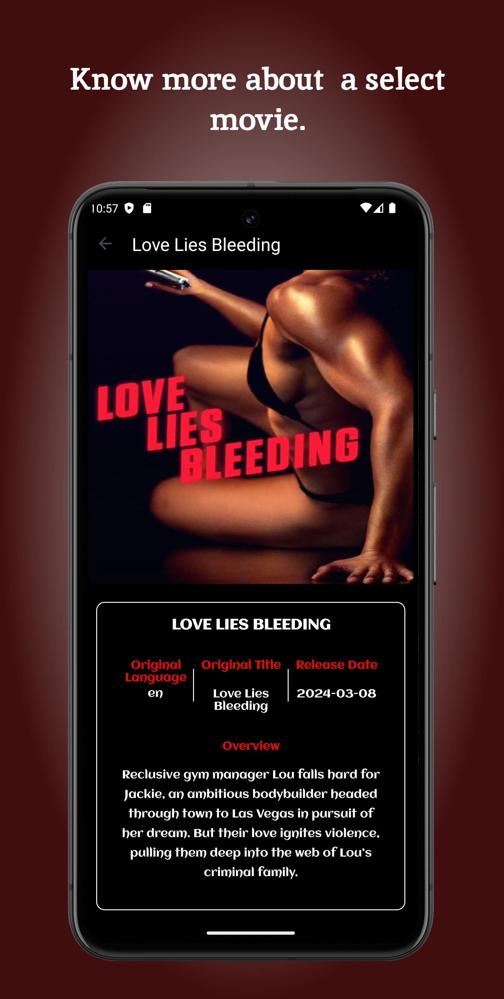

# Upcoming-Movies
Project 5: Android Kotlin Developer Udacity | Nanodegree

## App ScreenShots and Demo
|   |   |   |  |
|:-------------------------------:|:-------------------------------:|:-------------------------------:|:------------------------------:|

[//]: # (|  |  |  |)
## Rationale
> The App is inspired by The Android Kotlin Developer Nanodegree Course on Udacity. It's the final project of the Five projects in the course.
> I Chose to develop a custom app, so I can build everything from scratch. It's been fun. 

## Project Instructions 
+ The student will define their own project feature-set that meets criteria encompassing key areas of development skills covered within the nanodegree:
  + Application Architecture
  + UI and Layout
  + API Connectivity and Data Persistence
  + Hardware Integration
  + User-based Functionality

## Implementation
### Built with 
+ [Kotlin]()
+ [XML]()
+ [Android Studio Iguana | 2023.2.1 Patch 1]()
+ [MVVM Architecture]()
### Tools and Libraries
+ [Retrofit]()
+ [Room]()
+ [Dagger Hilt]()
+ [Repository Pattern]()
+ [Data Binding]()
+ [Navigation Library]()
+ [SharedPreferences]()
+ [ViewModel]()
+ [LiveData]()
+ [ListAdapter]()
+ [DiffUtil]()
+ [Notifications ]()
+ [Sealed Result Class]()
+ [Binding Adapters]()
+ [Work Manager]()
+ [MotionLayout]()